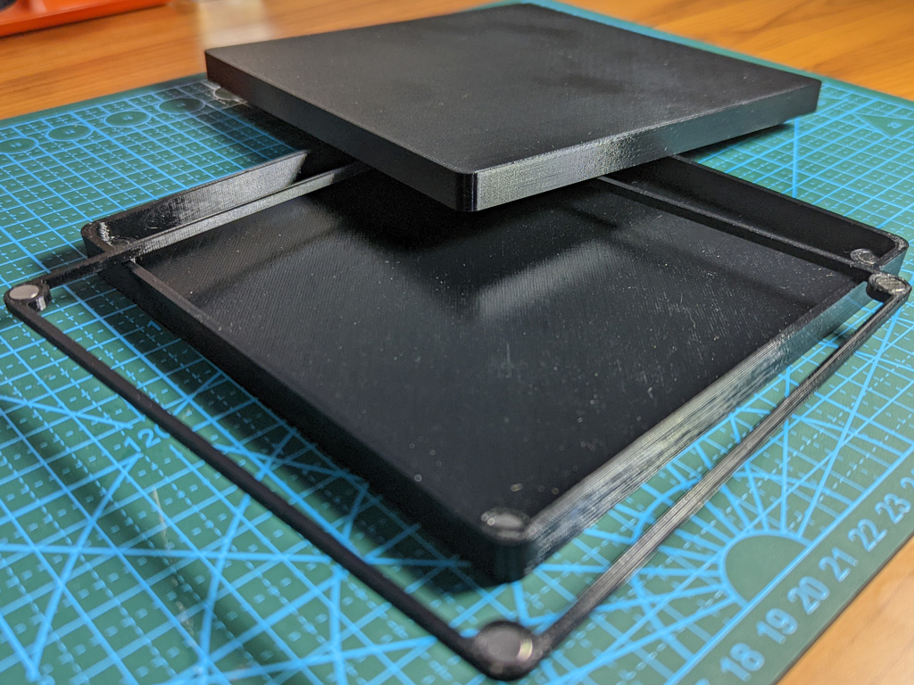

A parametric magnetically assembled 3D printable wet palette, inspired by [David Warboss's Wet Palette](https://www.prusaprinters.org/prints/36514-wet-palette). Defaults are for a larger palette (~150x150mm) using 2x6mm cylinder magnets to hold the mid body frame into the base.

To customize this palette, clone the repository then adjust the values for scad/PaletteBottom.scad, scad/PaletteMid.scad, and scad/PaletteLid.scad in OpenSCAD. PaletteShapes.scad must be in the same folder so that it can be imported into all 3 parts.

## Printing
I strongly recommend printing with PETG for flexibility. No supports should be necessary.

## Assembly
Insert magnets into the cavities in PaletteBottom and PaletteMid. Be careful to make sure the magnet polarities match! Place a wet folded paper towel in the bottom, and cover it with a sheet of baking paper cut to cover the magnets. Place the mid body over the baking paper to hold it in place, magnets side up. The lid should slide on relatively tightly and keep your wet palette wet for reuse.

## On Magnet Tolerances
By default, these print with 0 tolerances for magnet size; In my print of this, this results in a friction fit for the magnets that has held up quite well. If your printer is less accurate, you can increase this tolerance, but if you make it too loose you'll need to glue the magnets in.

## Previewing seems to be much faster than rendering
The base PaletteShapes.scad modules switch $fn from 36 for preview to 360 for smoother curves. If your computer is having difficulty with this you can drop this value down, but you will have less round corners which may affect fit beyond a certain point.